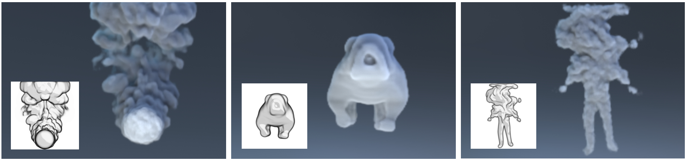

# Deep Reconstruction of 3D Smoke Densities from Artist Sketches

Pytorch implementation of [Deep Reconstruction of 3D Smoke Densities from Artist Sketches](http://www.byungsoo.me/project/sketch2density). 

[Byungsoo Kim](http://www.byungsoo.me), [Xingchang Huang](https://people.mpi-inf.mpg.de/~xhuang), Laura Wuelfroth, [Jingwei Tang](https://people.inf.ethz.ch/~jitang/), [Guillaume Cordonnier](http://www-sop.inria.fr/members/Guillaume.Cordonnier), [Markus Gross](https://graphics.ethz.ch/people/grossm), [Barbara Solenthaler](https://graphics.ethz.ch/~sobarbar/)

ETH Zurich, Max Planck Institute for Informatics, Inria, Universit&eacute; C&ocirc;te d'Azur

Computer Graphics Forum (Proceedings of Eurographics 2022)



## Install

We strongly recommend use a conda enviroment to develop this package. If you don't have one create it.

```bash
  # install conda
  wget https://repo.continuum.io/miniconda/Miniconda3-latest-Linux-x86_64.sh
  chmod +x Miniconda-latest-Linux-x86_64.sh
  ./Miniconda3-latest-Linux-x86_64.sh

  # update conda
  conda update -y conda
  
  # create conda environment
  conda env create -f project_env.yml
  conda activate sketch2fluid
```

## Original Repository

https://gitlab.ethz.ch/cglsim/sketch2fluid